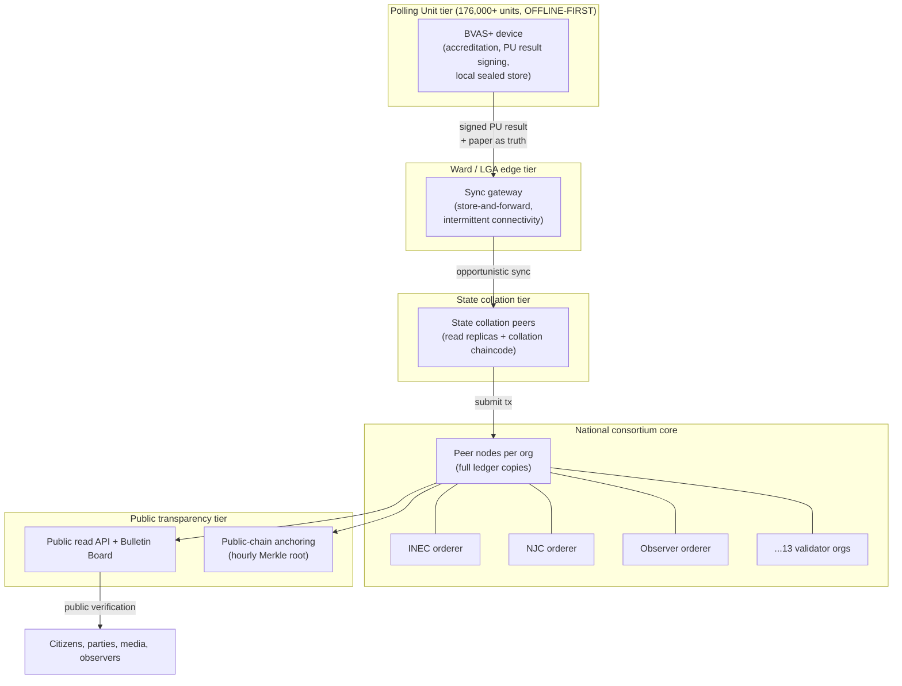
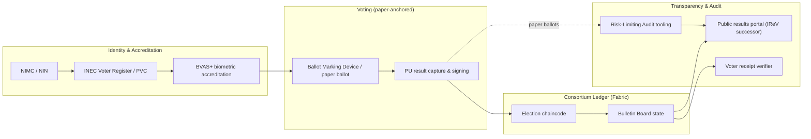

# 01 — Blockchain & System Architecture

*Covers brief §2 (Blockchain Architecture) and the architectural parts of §11.*

---

## 1. The decision in one paragraph

We recommend a **permissioned consortium blockchain built on Hyperledger Fabric**,
operating **not as the ballot box but as a national, append-only, multi-party
bulletin board** for signed polling-unit results, audit events, and cryptographic
commitments. Consensus is **Byzantine-fault-tolerant (BFT)**, not proof-of-work.
The chain stores *commitments and signed tallies*, never raw ballots or
voter-linkable data. This choice maximizes governance separation, throughput,
and privacy while keeping costs and energy use rational for a public institution.

---

## 2. Why "blockchain at all?" — the honest framing

Before choosing *which* blockchain, we must justify using one. A distributed
ledger earns its place **only** if you need:

- **Multiple mutually-distrusting parties** to share one authoritative record, **and**
- **No single party** that all others will accept as the sole keeper of that record, **and**
- **Tamper-evidence and non-repudiation** that survive even insider attack.

Nigerian collation is *exactly* this situation. The 2023 cycle's central dispute
was not "were votes mis-marked on paper at the polling unit" — it was **"do we
trust the transmission and collation of results between the polling unit and the
national tally?"** When INEC alone holds the results database, every losing party
can allege manipulation, and there is no cryptographic way to disprove it. A
consortium ledger where **INEC, the judiciary, observers, academia, and parties
each run a node and each holds a verified copy** turns "trust INEC's server" into
"trust the math and the fact that 9 independent institutions all witnessed the
same signed record." **That is the real, defensible value proposition** — and it
is a *governance/transparency* benefit, not a voting-mechanism benefit.

What blockchain does **not** buy us, and we will not pretend otherwise:
- It does not make a malicious or buggy voting device honest (garbage in → immutable garbage).
- It does not stop coercion or vote-buying.
- It does not protect secrecy by itself (naive on-chain votes are *less* private).
- It does not replace paper or audits.

> **Design rule:** the ledger records *what was reported*, with un-forgeable
> attribution and ordering. Whether what was reported is *true* is established by
> paper + RLA, not by the chain.

---

## 3. Blockchain model selection

| Model | Who can read | Who can write/validate | Verdict for Nigeria |
|-------|--------------|------------------------|---------------------|
| **Public permissionless** (Bitcoin, Ethereum L1) | Anyone | Anyone (PoW/PoS) | ❌ No identity control over validators, no native privacy, pseudonymous validators can't be held to Nigerian law, energy/cost irrational, throughput too low at L1, MEV/reorg risk. Public *readability* is desirable, but achievable far more cheaply. |
| **Private (single-org)** | One org | One org | ❌ No better than a normal replicated database with signatures; provides none of the multi-party trust that is the whole point. |
| **Consortium / permissioned** | **Public (read)** + members | A fixed, vetted set of institutions | ✅ **Recommended.** Identity-controlled validators bound by MOUs and law; BFT consensus; high throughput; privacy via channels/collections; auditable; cheap. |
| **Hybrid (consortium + public anchoring)** | Public | Consortium validates; periodic state roots anchored to a public chain | ✅✅ **Recommended enhancement.** Best of both: consortium governance + an extra, externally-immutable "notarization" that even a fully-colluding consortium cannot quietly rewrite. |

**Recommendation: Consortium-permissioned core, with optional public anchoring**
(a Merkle root of the ledger state published hourly to a public chain such as
Ethereum/Bitcoin via OpenTimestamps-style notarization). The anchor costs cents,
adds an independent immutability witness, and closes the "what if *all* validators
collude" gap (see Threat Model T9).

---

## 4. Platform comparison

| Criterion | **Hyperledger Fabric** ✅ | Quorum / Hyperledger Besu (IBFT) | Ethereum L2 (rollup) | R3 Corda |
|-----------|--------------------------|----------------------------------|----------------------|----------|
| Trust model | Permissioned consortium | Permissioned (EVM) | Public (settles to public L1) | Permissioned, point-to-point |
| Consensus | Pluggable; **BFT (SmartBFT)** | IBFT 2.0 / QBFT (BFT) | Inherits L1 + sequencer | Notary (pluggable, can be BFT) |
| Privacy model | **Channels + Private Data Collections**; data need not hit every node | Private transactions (Tessera) | Public by default; needs ZK overlay | **Strong** — data shared only with parties to a transaction |
| Smart contracts | **Chaincode** (Go/Java/Node) — general purpose | Solidity/EVM | Solidity/EVM | CorDapps (JVM) |
| Throughput | **3k–20k TPS** achievable | ~hundreds–low thousands | Variable, sequencer-bound | High for bilateral |
| Identity | **X.509 MSP / CA per org** — maps cleanly to institutions | Account keys | Pseudonymous accounts | X.509 + network map |
| Maturity / governance fit | **Linux Foundation, broad gov adoption** | Mature | Maturing, public exposure | Mature (finance) |
| Energy | Negligible | Negligible | Low (vs L1) but public | Negligible |

**Why Fabric wins for this use case:**

1. **Identity = institution.** Fabric's Membership Service Provider (MSP) issues
   X.509 certs per organization. "Validator = INEC / NJC / YIAGA / UNILAG" maps
   1:1 to MSPs. This is precisely the governance separation we need, and it is
   auditable and revocable under law.
2. **Privacy by construction.** Sensitive data (e.g. detailed PU breakdowns
   pre-publication) can live in *Private Data Collections* — only hashes hit the
   shared ledger — without bolting on a separate ZK system.
3. **No native token / no gas / no speculation.** Critical for a government
   system: there is no cryptocurrency, no fee market, no MEV, no economic attack
   surface. (This alone disqualifies most public-chain framings.)
4. **General-purpose chaincode** lets us encode the full election lifecycle
   (open/close windows, role checks, threshold-signature verification) in audited
   Go, not constrained Solidity.

**Why not Corda:** Corda's point-to-point "need to know" model is superb for
bilateral financial deals but *works against* our goal of a **single shared,
publicly-witnessed tally**. We want broadcast transparency, not privacy between
parties. **Why not EVM/L2:** public exposure, account-based pseudonymity, and gas
economics add risk and cost without adding governance value here. We instead *use*
a public chain only as a cheap external notary (§3).

---

## 5. Consensus: why BFT, why not PoW

**Proof-of-Work is wrong for this system, unambiguously:**

- Its security model assumes *anonymous, economically-incentivized* miners and a
  cryptocurrency to pay them. There is no token here and validators are *known
  institutions* — PoW's entire premise is absent.
- It is probabilistic (forks/reorgs). An election ledger needs **deterministic
  finality**: once a PU result is committed, it must never silently "un-commit."
- It wastes enormous energy for zero benefit in a permissioned setting.
- It would let raw hashpower (which a nation-state could rent) rewrite history —
  the *opposite* of what we want.

**Recommended: SmartBFT (a PBFT-family BFT ordering service for Fabric).**

- **Deterministic finality** — committed = final, no reorgs.
- **Tolerates up to f Byzantine (malicious/faulty) nodes out of 3f+1.** With our
  target of **~13 validator organizations**, the network survives up to **4
  simultaneously malicious or colluding validators** while remaining correct and
  live. This is the mathematical backbone of "no single (or small) group of
  institutions can forge results."
- **Known validator set** → accountability: a misbehaving node is identifiable,
  attributable, and legally/contractually answerable.

**Consensus parameters (proposed):**

| Parameter | Value | Rationale |
|-----------|-------|-----------|
| Ordering service | SmartBFT | Byzantine fault tolerance with finality |
| Validator orgs (orderers) | 13 (see §6) | Tolerates 4 Byzantine; broad institutional spread |
| Fault tolerance | f = 4 of 3f+1 = 13 | Survives collusion of any 4 institutions |
| Block cut | 2s OR 500 tx OR 1MB | Fast finality without tiny blocks |
| Finality | Immediate on commit | No probabilistic settlement |

---

## 6. Node & validator structure

The political legitimacy of the system rests entirely on **who runs the nodes.**
Validators must span institutions that do *not* share a chain of command, so that
collusion requires an implausibly broad conspiracy.

### 6.1 Validator (orderer) organizations — proposed 13

| # | Organization | Category | Why included |
|---|--------------|----------|--------------|
| 1 | **INEC** | Electoral authority | Constitutional administrator of elections |
| 2 | **National Judicial Council (NJC)** | Judiciary | Independent arbiter; courts adjudicate disputes |
| 3 | **National Human Rights Commission (NHRC)** | Independent statutory body | Rights/oversight mandate |
| 4 | **YIAGA Africa / domestic observer coalition** | Civil society | Credible, independent parallel-vote-tabulation history |
| 5 | **Nigeria Civil Society Situation Room** | Civil society umbrella | Broad CSO representation |
| 6 | **University consortium A (e.g. UNILAG)** | Academia (South) | Technical custodian, geographic balance |
| 7 | **University consortium B (e.g. ABU Zaria)** | Academia (North) | Technical custodian, geographic balance |
| 8 | **Nigerian Bar Association (NBA)** | Legal profession | Independent legal witness |
| 9 | **Institute of Chartered Accountants (ICAN)** | Audit profession | Numerical/audit credibility |
| 10 | **Inter-Party Advisory Council (IPAC)** node A | Party representation | Rotating among registered parties |
| 11 | **IPAC node B** | Party representation | Second party seat (different party) |
| 12 | **Accredited international observers (e.g. ECOWAS/AU/EU mission)** | International | Read-witness + limited validation during cycle |
| 13 | **National Information Technology Development Agency (NITDA)** | Technical regulator | Infrastructure/standards stewardship |

> **Governance guardrail:** No single ministry, party, or branch of government
> controls a *blocking* fraction (>f). Party seats rotate and are balanced
> between government and opposition. International observers' validation rights are
> time-boxed to the active election window.

### 6.2 Node tiers

- **Polling-unit tier** does *not* run blockchain nodes. It runs hardened
  BVAS-class devices that **sign** results offline. (Putting a consensus node in
  176k field locations would be absurd operationally and a security nightmare.)
- **Edge/state tiers** are store-and-forward gateways and read peers.
- **Core** is the ~13-org consortium with full peers + BFT orderers, hosted across
  geographically separate, independently-administered data centers (see
  [09-technical-architecture](09-technical-architecture.md)).
- **Public tier** exposes read-only verification + external anchoring.

---

## 7. What is (and isn't) on the ledger

| On-ledger (committed, replicated, public) | **Off**-ledger / never on-ledger |
|-------------------------------------------|-----------------------------------|
| Signed polling-unit result tuples (per contest counts) | Raw ballots / individual vote choices linked to identity |
| Hash/commitment of the official PU result sheet (EC8 form) image | Voter PII (NIN, BVN, fingerprints, photos) |
| Device & officer attestation signatures | Biometric templates |
| Threshold-signed certification events | Anything that could de-anonymize a voter |
| Audit-trail events (open/close, exceptions) | Plaintext that violates NDPA |
| Cryptographic commitments for E2E-V receipts | Private keys |
| Merkle roots anchored externally | |

> The chain is **append-only and minimal**. We deliberately keep PII and ballots
> *off* it, because "immutable" + "personal data" is a privacy catastrophe and an
> NDPA violation waiting to happen. See [03-cryptography](03-cryptography-and-privacy.md)
> and [07-governance-legal](07-governance-legal.md).

---

## 8. High-level system architecture

This is the spine. Subsequent documents zoom into each block:
identity ([02](02-identity-and-voting.md)), the voting workflow with sequence
diagrams ([02](02-identity-and-voting.md)), cryptography ([03](03-cryptography-and-privacy.md)),
and the full technical/infra view ([09](09-technical-architecture.md)).

---

## 9. Key architectural trade-offs (stated plainly)

| Trade-off | Our choice | What we give up |
|-----------|-----------|-----------------|
| Transparency vs. privacy | Public *tallies*, private *ballots*; PII off-chain | Some "everything on chain" purists' appeal |
| Decentralization vs. performance | 13 BFT validators (not thousands) | Maximal decentralization (unnecessary, costly) |
| Immutability vs. correctability | Append-only + *compensating* correction entries, never deletes | Ability to silently fix mistakes (by design) |
| Innovation vs. legitimacy | Paper-anchored, blockchain as bulletin board | "Pure digital" novelty |
| Cost vs. redundancy | Geographically-separate national core, offline-first edge | Cheapest-possible centralized build |
