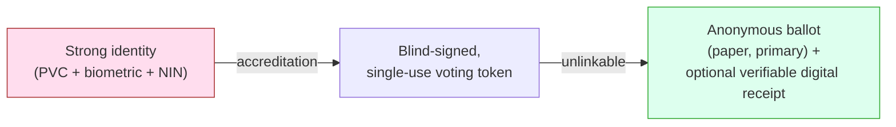
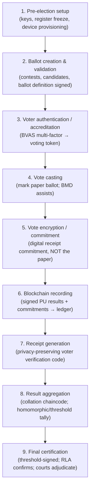
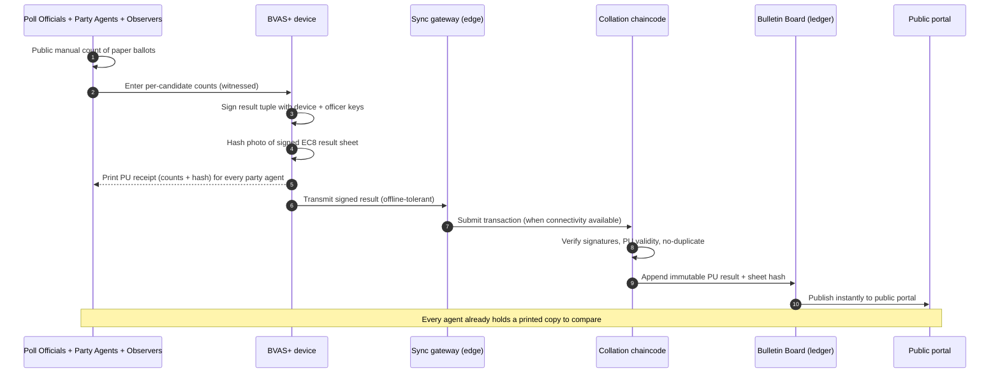

# 02 — Identity, Registration & the Voting Workflow

*Covers brief §3 (Voter Registration & Identity Verification) and §4 (Voting Process).*

---

## Part A — Identity & registration

### A1. Build on what exists; replace nothing wholesale

Nigeria already has the pieces. Our job is to bind them, not reinvent them.

| Asset | Custodian | Role in our design |
|-------|-----------|--------------------|
| **National Identity Number (NIN)** | NIMC | Foundational legal identity; de-duplication root |
| **Permanent Voter Card (PVC)** | INEC | Proof of registration in a specific polling unit |
| **Voter register (biometrics)** | INEC | Fingerprint + facial templates for accreditation |
| **BVAS** | INEC | Bimodal (fingerprint + facial) accreditation device, already deployed |
| **BVN** | CBN/NIBSS | *Optional* cross-check only; **not** required (banking exclusion would disenfranchise) |

> **Policy stance:** NIN should be the de-duplication backbone (one human → one
> NIN → at most one voter record), but **lack of NIN must never block an existing
> validly-registered PVC holder from voting.** Tying voting hard to NIN risks
> mass disenfranchisement given incomplete NIN coverage. NIN is used to *clean the
> register*, not to *gate the ballot*.

### A2. The privacy problem at the core of identity

The hardest requirement: **authenticate strongly, then forget who you are.** We
must prove "this is an eligible, not-yet-voted voter" and then ensure the ballot
that results **cannot be linked back to them.** Our answer combines:

- **Accreditation and voting are separated** (as they already are operationally:
  BVAS accredits; the ballot is cast separately). The link between a voter's
  identity and their specific ballot is broken by physical ballot secrecy (paper)
  and by **blind-signed voting credentials** for any digital component.
- **No raw biometric or NIN ever touches the ledger.** Accreditation produces only
  an anonymous, single-use **voting token** (a blind-signed credential — see
  [03-cryptography](03-cryptography-and-privacy.md) §Blind signatures).

### A3. Multi-factor accreditation

Accreditation at the polling unit uses **three factors**, degrading gracefully:

1. **Something you have** — PVC (or NIN-linked credential).
2. **Something you are** — fingerprint *and/or* facial biometric via BVAS.
3. **Where/when** — bound to the voter's assigned polling unit and the election
   time window (prevents out-of-unit and out-of-time accreditation).

```mermaid
sequenceDiagram
    autonumber
    actor V as Voter
    participant P as Poll Official
    participant B as BVAS+ device (offline)
    participant L as Local sealed register (on device)

    V->>P: Presents PVC / states NIN
    P->>B: Scan PVC / enter VIN
    B->>L: Look up voter record for THIS polling unit
    alt Record found & not yet accredited
        B->>V: Capture fingerprint
        alt Fingerprint match
            B->>L: Mark accredited; emit anonymous voting token
        else No fingerprint match
            B->>V: Capture facial biometric
            alt Face match
                B->>L: Mark accredited (flag: face fallback)
            else Both fail
                B->>P: Escalate to INCIDENT FORM (manual, witnessed)
                Note over P,V: Cannot silently fail — paper exception path
            end
        end
    else Already accredited / wrong unit
        B->>P: REJECT — duplicate / wrong PU
    end
```

**Duplicate-vote prevention (defense in depth):**
1. *Local*: BVAS marks the record accredited; a second attempt on the same device fails.
2. *Synchronized*: accreditation events sync to the ledger; cross-PU duplicates
   (someone who somehow got on two registers) are detected at collation and flagged.
3. *Register hygiene (pre-election)*: NIN-based de-duplication removes double
   registrations before election day (the strongest, cheapest control).
4. *Physical*: one paper ballot issued per accredited voter; ballot accounting
   (issued vs. cast vs. spoiled) must reconcile at PU close.

### A4. Preserving anonymity after authentication



The **blind signature** (Chaum) lets BVAS sign "this voter is entitled to one
ballot" *without seeing the token's unique serial*, so when the token is later
spent, it proves eligibility but **cannot be correlated to the voter's identity.**
Combined with the physical secrecy of the paper ballot, this gives
*one-person-one-vote* AND *ballot secrecy* simultaneously. Full crypto detail in
[03](03-cryptography-and-privacy.md).

---

## Part B — End-to-end voting workflow

### B0. Cardinal rule

**The paper ballot is the vote.** Everything digital is (a) an accessibility/UX
aid to *mark* it, (b) a *fast, tamper-evident* way to *report and aggregate* it,
and (c) a means to *verify and audit* it. If digital and paper ever disagree, the
**paper, confirmed by audit, wins** — by law.

### B1. The nine stages



### B2. Stage detail

**1. Pre-election setup.**
- Trustees (consortium members) jointly generate the **election public key** via
  *distributed key generation*; the private key is **threshold-shared** so no one
  trustee can decrypt anything (see [03](03-cryptography-and-privacy.md)).
- Voter register is **frozen** and its hash committed to the ledger (so the
  register cannot be silently edited mid-election).
- BVAS+ devices are provisioned with the PU-specific register slice, signed
  firmware, and per-device keypairs. Chain-of-custody logged.

**2. Ballot creation & validation.**
- INEC defines the six contest ballots; the **ballot definition** (contests,
  candidates, party logos, ballot ordering) is signed by INEC + at least one
  observer org and committed on-chain. Any device renders only the
  signature-valid ballot definition. Prevents "ghost candidate"/altered-ballot
  attacks.

**3. Voter authentication / accreditation.** As Part A3. Output: an **accredited**
mark + an anonymous **voting token**. No identity flows onward.

**4. Vote casting.**
- Default: voter marks a **paper ballot** by hand (familiar, software-independent).
- Assisted: a **Ballot-Marking Device (BMD)** with audio, large-text, and
  multilingual UI helps voters with disabilities/low literacy *produce a
  human-readable printed paper ballot*, which the voter verifies and deposits.
- The ballot box (physical) remains the legal repository.

**5. Vote encryption / commitment.**
- This applies to the **digital verifiability layer**, not the paper. When a voter
  opts in to a verifiable receipt, the marked selections are **encrypted under the
  election public key** and a **commitment** is recorded. The plaintext choice is
  never stored against identity. (This is the ElectionGuard-style pattern.)

**6. Blockchain recording.**
- At PU close, officials and observers **publicly count the paper**, fill the
  result sheet (EC8-series form), and the BVAS+ device produces a **signed PU
  result tuple** + a hash of the photographed result sheet. This is submitted to
  the ledger (online when possible; store-and-forward otherwise — see
  [05](05-offline-connectivity.md)).



**7. Receipt generation.**
- Each **party agent** at the PU receives a printed copy of the signed PU result +
  its hash. Anyone can later confirm the ledger entry matches their printout
  (catches any tampering between PU and national tally — the historic failure point).
- Each **voter** (optionally) receives a **tracking code** that lets them confirm
  on the public portal that their encrypted ballot was *recorded* — but the code
  reveals *nothing* about their choice and cannot be used to prove a vote to a
  coercer (see coercion-resistance, [03](03-cryptography-and-privacy.md)).

**8. Result aggregation.**
- Collation chaincode aggregates verified PU tuples up the hierarchy
  (PU → Ward → LGA → State → National), each level's sum independently
  recomputable by anyone from the public PU data. **No human "collation officer"
  can inject numbers that don't sum from published PU results.**
- For the digital verifiability layer, **homomorphic aggregation** of encrypted
  ballots produces an encrypted total that **threshold-trustees jointly decrypt**,
  yielding a tally *with a proof* it was computed correctly — without ever
  decrypting an individual ballot.

**9. Final certification.**
- A **Risk-Limiting Audit** of the paper (statistically sufficient sample,
  publicly observed) must confirm the reported outcome before certification.
- Certification is a **threshold-signed** ledger event (requires k-of-n consortium
  trustees), anchored externally. Disputes go to the Election Petition Tribunals,
  who now have a **cryptographically complete, court-admissible audit trail**.

### B3. End-to-end sequence (condensed, voter's eye view)

```mermaid
sequenceDiagram
    autonumber
    actor V as Voter
    participant B as BVAS+
    participant BMD as Paper ballot / BMD
    participant Box as Ballot box (paper = truth)
    participant Led as Ledger / Portal

    V->>B: Accredit (PVC + biometric)
    B-->>V: Anonymous voting token
    V->>BMD: Mark selections (assisted if needed)
    BMD-->>V: Human-readable paper ballot to VERIFY
    V->>Box: Cast verified paper ballot
    BMD-->>Led: (optional) encrypted ballot commitment + tracking code
    Note over Box,Led: At close: public count → signed PU result → ledger
    V->>Led: Later: check tracking code "recorded as cast"
    Note over V,Led: Voter can verify INCLUSION, not REVEAL choice
```

---

## Part C — The three guarantees, mapped to mechanisms

| Guarantee | Primary mechanism (software-independent) | Reinforcing digital mechanism |
|-----------|------------------------------------------|-------------------------------|
| **One person, one vote** | BVAS biometric accreditation + paper ballot accounting + NIN de-dup | Blind-signed single-use token; duplicate detection on ledger |
| **Ballot secrecy** | Physical secrecy of paper ballot; accreditation/voting separation | Blind signatures unlink token from identity; encryption hides digital choice |
| **Vote integrity / counted-as-cast** | Public manual count; RLA on paper | Signed PU results on append-only ledger; party-agent printed receipts; homomorphic tally proof |

> Notice the pattern: **the real guarantee always comes from paper + public
> process + audit.** The cryptography and ledger make verification *faster,
> broader, and harder to dispute* — they are amplifiers of trust, not its source.
