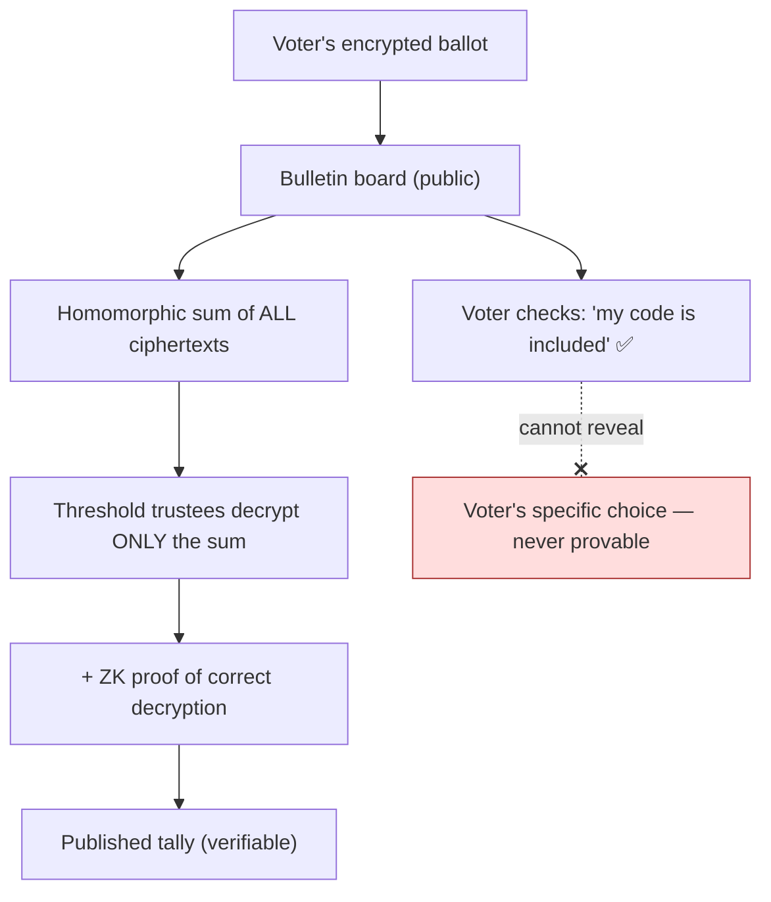

# 03 — Cryptography & Privacy

*Covers brief §5 (Privacy and Cryptography).*

---

## 0. Philosophy: use crypto where it earns its keep

Cryptography in elections is powerful but dangerous: a subtle protocol or
implementation flaw can silently break secrecy or integrity, and most voters and
officials cannot personally verify it. So our rule is:

> **Every cryptographic mechanism must (a) solve a problem paper alone cannot, and
> (b) be backed by a software-independent fallback (paper + RLA) so that a crypto
> failure degrades trust gracefully rather than catastrophically.**

We deliberately keep the *count of truth* on paper. The crypto below secures the
**reporting, aggregation, verification, and anti-coercion** layers.

---

## 1. The fundamental tension

There are two properties that pull in opposite directions:

- **Ballot secrecy / coercion resistance:** no one — not even the voter, when
  faced with a coercer or vote-buyer — should be able to *prove* how they voted.
- **Verifiability:** anyone should be able to confirm their vote was recorded and
  counted correctly.

A naive "put my vote on the blockchain so I can see it" design **fails secrecy
catastrophically**: a visible, voter-checkable vote is a *receipt* a vote-buyer
can demand. Real E2E-V systems thread this needle: you can verify **inclusion and
correctness** without producing a **proof of choice**. This is the single most
important crypto requirement, and the one most "blockchain voting" pitches get
fatally wrong.

---

## 2. The cryptographic toolkit (what, why, where)

### 2.1 End-to-end encryption (E2EE)
- **What:** ballots and result tuples encrypted in transit and at rest; device↔gateway↔ledger links use mutually-authenticated TLS; ballots encrypted under the election public key.
- **Why:** protects against network interception and at-rest theft.
- **Where:** all transmission ([05](05-offline-connectivity.md)); the digital verifiability layer.
- **Caveat:** E2EE protects *confidentiality in motion*; it does **not** by itself
  give verifiability or secrecy-from-the-voter. It's table stakes, not the clever part.

### 2.2 Blind signatures (Chaum)
- **What:** BVAS signs a voter's voting token *without seeing its unique serial*.
  The voter "blinds" the token, gets it signed (proving eligibility), then
  "unblinds" it — yielding a valid credential that the signer cannot link back.
- **Why:** **breaks the link between identity and ballot** while still enforcing
  one-person-one-vote. This is how you get *eligibility without traceability*.
- **Where:** accreditation → voting token ([02](02-identity-and-voting.md) §A4).

```mermaid
sequenceDiagram
    autonumber
    actor V as Voter device
    participant B as BVAS (signer)
    V->>V: Generate token serial s; blind it → s'
    V->>B: Present identity + s' (blinded)
    B->>B: Verify eligibility (biometric, not-voted)
    B-->>V: Sign s' → σ'  (signer never sees s)
    V->>V: Unblind σ' → σ = valid signature on s
    Note over V: Later spends (s, σ): proves eligible, unlinkable to identity
```

### 2.3 Zero-knowledge proofs (ZKPs)
- **What:** prove a statement is true without revealing the underlying data —
  e.g., "this encrypted ballot is a valid selection (exactly one candidate, no
  overvote)" without revealing *which*; or "I know a valid, unspent token."
- **Why:** lets the system **reject malformed/ballot-stuffing ciphertexts** and
  lets voters/auditors verify well-formedness **without** decryption. Underpins
  honest homomorphic tallying.
- **Where:** ballot well-formedness proofs; proof-of-correct-decryption at tally;
  nullifier-based double-spend prevention for the digital layer.

### 2.4 Threshold cryptography (distributed trust)
- **What:** the election private key is split into *n* shares held by separate
  consortium trustees; **any k of n** are needed to decrypt the aggregate, and
  **no fewer** can decrypt anything.
- **Why:** **no single institution can secretly decrypt ballots.** Decryption
  becomes a public ceremony requiring a quorum across rival institutions.
- **Where:** election key generation (DKG) and final tally decryption
  ([02](02-identity-and-voting.md) stages 1 & 8).
- **Parameters (proposed):** k = 7, n = 13 trustees (matches validator orgs).
  Tolerates up to 6 unavailable/colluding trustees without loss of secrecy or
  liveness.

### 2.5 Homomorphic encryption (verifiable tallying)
- **What:** an additively-homomorphic scheme (e.g. exponential ElGamal) lets you
  **add encrypted ballots without decrypting them**; you decrypt only the final
  *sum*.
- **Why:** produces an **official digital tally with a cryptographic proof of
  correctness**, while individual ballots are *never* decrypted. Auditors can
  verify the homomorphic aggregation independently.
- **Where:** digital aggregation layer (stage 8). This is the ElectionGuard model.
- **Caveat:** homomorphic tally is a *verification cross-check* of the paper count,
  not a replacement. If they disagree, RLA on paper adjudicates.

### 2.6 Mixnets (anonymity for the digital layer)
- **What:** a chain of mix servers (run by different trustees) shuffles and
  re-encrypts ballots, each proving (via ZK) it shuffled honestly, so input→output
  linkage is destroyed.
- **Why:** an alternative/complement to homomorphic tally when you need to decrypt
  *individual* (now-anonymized) ballots — e.g. for complex ranked contests —
  without linking them to voters.
- **Where:** optional, for contest types unsuited to homomorphic counting.
- **Trade-off:** verifiable mixnets are complex and a rich source of subtle bugs.
  We favor **homomorphic tally as primary** and treat mixnets as a specialized
  tool, not a default.

### 2.7 Hashing, commitments & external anchoring
- Merkle-tree commitments make the bulletin board efficiently and publicly
  verifiable (prove any entry's inclusion with a short proof).
- Hourly Merkle roots are **anchored to a public chain** ([01](01-architecture.md) §3),
  giving an immutability witness outside consortium control.

---

## 3. How the guarantees are met (precisely)

### 3.1 One person, one vote
- Biometric accreditation (BVAS) + **single-use blind-signed token** + on-ledger
  **nullifier set** (each spent token publishes a unique nullifier; re-use is
  publicly detectable without revealing identity) + paper ballot accounting +
  pre-election NIN de-duplication.

### 3.2 Ballot secrecy
- Physical secrecy of paper (primary). For the digital layer: blind signatures
  unlink identity↔token; encryption under a **threshold** election key hides
  content; homomorphic tally / mixnet ensures **individual ballots are never
  decrypted**; PII is **never** on-ledger.

### 3.3 Vote integrity (cast-as-intended, recorded-as-cast, counted-as-recorded)
| Sub-property | Mechanism |
|---|---|
| Cast as intended | Voter verifies the **human-readable paper** (BMD prints what voter confirms) |
| Recorded as cast | Tracking code lets voter confirm encrypted ballot **inclusion** on bulletin board; ZK well-formedness proof |
| Counted as recorded | Public manual count + **RLA on paper**; homomorphic tally with proof-of-correct-decryption; anyone re-sums published PU results |

### 3.4 Verifiability *without* exposing choices (coercion resistance)
- The tracking code proves **"a ballot of mine is in the set"**, not **"my ballot
  says X."** Because the choice is encrypted and the code is not a decryption key,
  **the voter cannot prove their selection to a third party** — defeating
  vote-buying-with-proof.
- **Benaloh challenge:** before casting, a voter may "challenge" the device to
  reveal/prove the encryption was honest; a challenged ballot is *spoiled* (not
  cast) and re-done. This catches a cheating device without compromising real
  ballots.



---

## 4. Cryptographic agility & quantum outlook

- Use **NIST-standardized** primitives; design for **crypto-agility** (algorithm
  identifiers in every signed object so schemes can be rotated).
- **Post-quantum:** national records may need decade-scale secrecy. Adopt
  **hybrid** signatures/KEMs (classical + ML-KEM/ML-DSA) for long-lived
  commitments. The threat to *secrecy* (harvest-now-decrypt-later) matters most;
  integrity signatures can be rotated per cycle.

---

## 5. Honest limitations of the crypto

1. **Implementation risk dominates.** The math is sound; the bugs live in code,
   key ceremonies, and RNGs. This is why **paper + RLA is non-negotiable** — it
   makes us robust to *unknown* crypto/software failure.
2. **Voter verification is rarely exercised.** Most voters won't check tracking
   codes. E2E-V's deterrence works only if *enough* people *can* and *some* do,
   plus mandatory audits. We must fund observer/CSO verification at scale.
3. **Coercion in the home / vote-buying without proof** is *mitigated*, not
   solved, by any crypto. Social and legal measures remain essential.
4. **Usability cost.** Each mechanism adds steps and failure modes; we expose
   *none* of this complexity to the ordinary voter — they mark paper. Complexity
   lives in auditable backend code and observer tooling.
