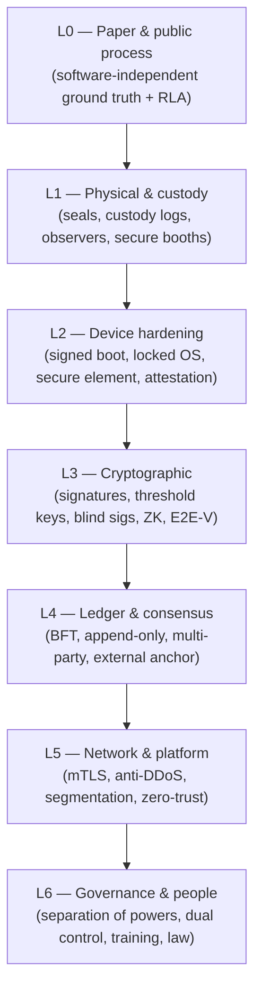

# 04 — Security Architecture, Threat Model & Risk Register

*Covers brief §6 (Security Architecture) and the Risk Register deliverable in §15.*

---

## 1. Methodology

We model threats with **STRIDE** (Spoofing, Tampering, Repudiation, Information
disclosure, Denial of service, Elevation of privilege) and rate each on
**Likelihood × Impact** (1–5 each; Risk = L×I, max 25). We assume a
**capable adversary including a nation-state and malicious insiders** — the
correct assumption for a national election. Mitigations follow the principle:
**security from separation of powers + verifiable math + paper fallback**, never
from trusting any single institution or device.

Severity bands: 🟥 Critical (15–25) · 🟧 High (9–14) · 🟨 Medium (4–8) · 🟩 Low (1–3).

---

## 2. Trust assumptions (stated explicitly)

- We **do not trust** any single device, vendor, official, or validator.
- We **do trust** that ≥ (n−f) of 13 validators are honest at any time (BFT bound),
  and that ≥ k of n threshold trustees won't *all* collude.
- We **assume** the paper trail is physically securable at the PU and during a
  public, observed count, and that RLAs are genuinely conducted.
- We **assume** voters' personal devices are *potentially compromised* — hence no
  binding vote is ever cast from one.

---

## 3. Threat catalog & risk register

| ID | Threat | STRIDE | L | I | Risk | Mitigations | Incident response |
|----|--------|--------|---|---|------|-------------|-------------------|
| **T1** | **Insider at INEC alters results / register** | T,E,R | 3 | 5 | 🟥 15 | Append-only ledger (no silent edits); register hash frozen on-chain; multi-party validation means INEC alone cannot commit accepted results; dual-control + HSM for keys; full attributable audit log; RLA on paper | Detect via ledger/anchor mismatch or RLA divergence → freeze affected PUs, forensic export, judicial referral, recount from paper |
| **T2** | **Validator collusion** (small set rewrites/forks ledger) | T,S | 2 | 5 | 🟧 10 | BFT tolerates f=4 of 13; validators are *rival* institutions (judiciary, opposition, observers, academia); external public-chain anchoring catches even full-consortium rewrite; all blocks multi-signed | Anchor/ledger mismatch triggers public alert; affected epoch invalidated; fall back to paper + party-agent printed receipts |
| **T3** | **Nation-state network/infra attack** (BGP, DNS, undersea cable, telco) | D,T | 3 | 4 | 🟧 12 | Offline-first design: voting never needs connectivity; multi-path sync (fiber, 4G, VSAT, physical courier); geographically + administratively separate national core; signed payloads survive hostile networks | Switch to physical-transport sync; results still provable via signatures; extend collation window per law |
| **T4** | **DDoS on public portal / collation endpoints** | D | 4 | 3 | 🟧 12 | Public *read* layer behind CDN/anti-DDoS, fully cacheable & static-friendly; collation ingest separate from public read; rate limits; ingest tolerates delay (store-and-forward) | Serve cached results; scale CDN; ingest queues drain when restored; DDoS cannot alter recorded results, only delay visibility |
| **T5** | **Malware on voting/marking device (BMD/BVAS)** | T,S | 3 | 5 | 🟥 15 | **Paper is verified by the human** → device cannot silently flip a verified ballot; signed/measured boot, locked-down OS, no general network at PU; Benaloh challenge; **RLA catches systematic BMD bias** | Anomaly/RLA flag → quarantine device batch, supply-chain trace, manual recount of affected PUs |
| **T6** | **Credential theft** (officer/validator keys) | S,E | 3 | 4 | 🟧 12 | Hardware-backed keys (HSM/secure element); MFA + biometric for officials; short-lived certs; per-device keys; threshold keys (one stolen share is useless); rapid revocation via MSP CRL | Revoke cert, rotate, re-issue; ledger shows exactly what the stolen key signed; invalidate affected entries |
| **T7** | **Supply-chain compromise** (tampered devices/firmware/dependencies) | T,E | 3 | 5 | 🟥 15 | Reproducible builds; signed firmware w/ measured boot; SBOM + dependency pinning/SLSA; multi-vendor sourcing; pre-deployment random device attestation by observers; tamper-evident seals + custody logs | Attestation failure → pull batch; cross-check against paper; public disclosure; vendor legal action |
| **T8** | **Social engineering** of officials/voters | S | 4 | 3 | 🟧 12 | Mandatory training & phishing drills; out-of-band verification for sensitive ops; dual-control (no single person can act alone); clear, non-spoofable official channels; voter education on the *paper* being authoritative | Report channel; revoke any access touched; targeted re-training; flag affected PUs for audit |
| **T9** | **Vote manipulation in transmission/collation** (the historic Nigerian failure) | T | 3 | 5 | 🟥 15 | PU results **signed at source**; party agents hold **printed receipts** to compare; every aggregation level is **publicly re-summable** from PU data; ledger + external anchor make any post-PU change detectable | Mismatch between printed receipt and portal → instant public evidence; tribunal-admissible; recompute from PU layer |
| **T10** | **Ballot-box stuffing / fake PUs / inflated turnout** | S,T | 3 | 4 | 🟧 12 | Biometric accreditation caps ballots to accredited voters; ballot accounting reconciliation; accreditation count published on-chain and cross-checked vs. results; observer presence | Turnout/accreditation mismatch flags PU; exclude/recount per tribunal |
| **T11** | **Voter coercion / vote-buying** | I | 4 | 4 | 🟧 16 | Secret paper ballot; **receipt-freeness** (tracking code can't prove choice); Benaloh challenge; legal penalties; private voting booth enforced | Investigate/prosecute; coercion is primarily social/legal, tech only limits *provability* |
| **T12** | **Voter de-anonymization / privacy breach** | I | 2 | 5 | 🟧 10 | PII never on-ledger; blind signatures; accreditation/voting separation; threshold encryption; NDPA-compliant data minimization; biometrics never leave device unencrypted | Breach response per NDPA; notify NDPC; rotate; forensic scope |
| **T13** | **Denial of service to *voters*** (devices fail, power out) | D | 4 | 4 | 🟧 16 | Every device has battery + solar/power-bank; **paper-only fallback works with zero electronics**; spare devices per ward; manual accreditation register as last resort | Switch to paper-manual at PU; log incident; results still valid via signed manual sheet |
| **T14** | **Disenfranchisement via system complexity/exclusion** | — | 4 | 4 | 🟧 16 | Paper-first, BMD-assisted; multilingual; offline; see [06-accessibility](06-accessibility.md) | Ombudsman + rapid field support; this is treated as a *security* risk to legitimacy |
| **T15** | **Forked/false public portal (phishing the verification)** | S | 3 | 3 | 🟨 9 | Signed results verifiable independently of any one portal; published trust roots; multiple independent verifier apps (observers, parties); anchor cross-check | Public advisory; promote independent verifiers; signatures defeat fakes |
| **T16** | **Key-ceremony compromise** (election master key) | I,T | 2 | 5 | 🟧 10 | Threshold DKG (no single point holds key); public, observed, recorded ceremony; HSMs; geographic share distribution | Abort & re-key if ceremony integrity in doubt (pre-election only) |

> **Pattern to notice:** every 🟥 Critical threat is contained primarily by
> **paper + public process + audit**, with crypto/blockchain as the *detection
> amplifier*. That is the design working as intended.

---

## 4. Defense-in-depth layers

A breach of any single layer is contained by the others; critically, a total
failure of layers L2–L5 (all software/crypto/network) still leaves **L0/L1 — the
paper — intact and auditable.**

---

## 5. Incident response (operational)

- **Severity classification & CSIRT.** A standing **Election Security Operations
  Center (E-SOC)** with a multi-stakeholder CSIRT (INEC + NITDA + observers +
  independent security firms). 24/7 during the election window.
- **Playbooks** for each threat class above, pre-approved and rehearsed in the
  pilot phases. Tabletop + red-team exercises before every national cycle.
- **Golden rule of response:** *the paper trail is the recovery mechanism.* Any
  digital incident triggers (1) containment, (2) preservation of evidence
  (immutable ledger + anchor already do this), (3) fallback to paper/manual for
  affected scope, (4) public, timely disclosure, (5) judicial referral.
- **Transparency in incidents.** Concealment destroys trust faster than the
  incident itself. Pre-commit to a disclosure SLA.
- **Coordinated vulnerability disclosure** program + bug bounty on the open-source
  components, running continuously (not just at election time).

---

## 6. Red-team & assurance program

- Independent, adversarial **penetration testing** and **public code audits** of
  all critical components before each phase.
- **Public test elections** ("mock elections") where the public is *invited to
  attack* the system — the strongest possible assurance and trust-builder.
- Mandatory **RLA** every election: not just security, but the statistical
  guarantee that ties everything together.
