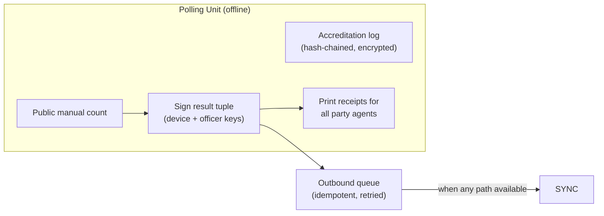
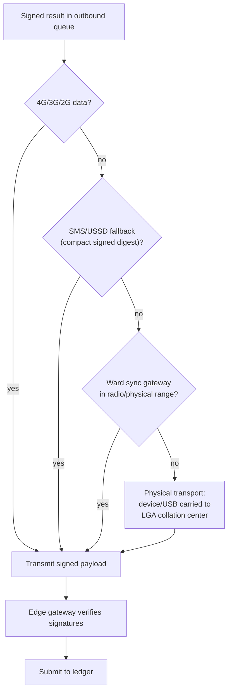
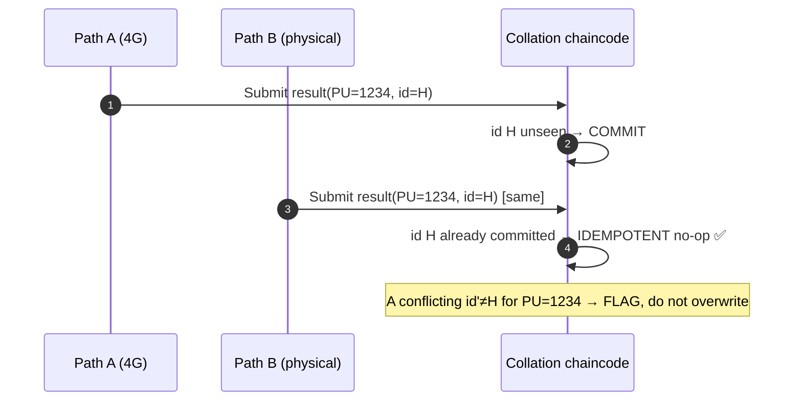

# 05 — Offline & Low-Connectivity Operation

*Covers brief §7 (Offline and Low-Connectivity Scenarios).*

---

## 1. Principle: offline-first, not offline-tolerant

Most "blockchain voting" designs assume always-on connectivity and break in rural
Nigeria. We invert the assumption:

> **The polling unit is assumed to be OFFLINE. Connectivity is an opportunistic
> bonus used only to *transmit already-signed, already-counted* results — never a
> prerequisite for voting, accreditation, or counting.**

This mirrors how BVAS already works (it accredits offline and transmits later) and
how Nigerian elections physically operate (count locally, transmit the result
sheet). We are securing an existing offline workflow, not imposing an online one.

---

## 2. What must work with zero connectivity

| Function | Connectivity needed? | How it works offline |
|----------|---------------------|----------------------|
| Voter accreditation | ❌ No | BVAS+ holds the PU register slice locally; biometric match is on-device |
| Vote casting | ❌ No | Paper ballot; BMD is a local device with no network |
| Counting | ❌ No | Public manual count of paper at PU close |
| Result signing | ❌ No | Device signs result tuple with locally-held keys |
| Party-agent receipts | ❌ No | Printed at the PU immediately |
| Result *transmission* | ✅ Eventually | Store-and-forward; syncs when any path appears |
| Ledger commit / portal | ✅ Eventually | Happens at edge/core once a result arrives |

**Nothing on the left half of "voting day" requires the internet.** Even total
nationwide connectivity loss does not stop voting or counting — only the *speed of
public visibility*.

---

## 3. Temporary offline capture & sealed local store

Each BVAS+ device maintains an **append-only, encrypted, tamper-evident local
store**:

- Accreditation events and the final signed PU result are written to a local
  hash-chained log (each entry references the previous entry's hash → tampering is
  detectable).
- The store is **encrypted at rest** (secure element) and the result is **signed**
  by both the device key and the presiding officer's credential.
- A **printed copy** of the signed result + its hash is given to every party agent
  at the PU — an immediate, paper, offline audit artifact that does not depend on
  any later sync.

---

## 4. Multi-path, opportunistic synchronization

Results sync over **whatever path appears first**, in priority order:

- **Data path:** full signed payload over mobile data when available.
- **SMS/USSD path:** for 2G-only areas, a **compact signed digest** (counts +
  signature + sheet hash) fits in a few SMS segments — enough to publish a
  *verifiable* result; the full payload and sheet photo follow later.
- **Mesh/ward gateway:** devices forward to a ward-level gateway that may have
  better connectivity (store-and-forward relay).
- **Physical transport (last resort):** the sealed device or an exported
  signed file on secure media is carried to the LGA collation center — exactly
  how paper result sheets already travel — and ingested there. **Because the
  payload is signed, physical transport over an untrusted route is still secure.**

---

## 5. Preventing duplicate submission during sync

The hard part of store-and-forward is **idempotency** — the same result must not
be counted twice if it arrives via two paths or is retried.

- Each PU result has a **deterministic unique ID**: `hash(electionId ‖ pollingUnitId ‖ resultRound)`.
- The collation chaincode enforces **"first valid signed result per PU is
  authoritative; later identical ones are idempotent no-ops; later *differing*
  ones are flagged as conflicts, never silently overwritten."**
- A **correction** requires an explicit, signed, witnessed *amendment* transaction
  (with reason code) — appended, never overwriting — so the full history of any
  change is public.
- Because the ledger is append-only and keyed by PU ID, **resubmission is safe by
  construction**: replays collapse to the same state.

---

## 6. Failover & resilience procedures

| Failure | Failover |
|---------|----------|
| Device dies / battery flat | Swap to **spare device** per ward; device store is recoverable from sealed media; worst case → **manual paper register + hand-counted, manually-signed result sheet** (fully valid) |
| No power | Battery + solar charger + power bank per kit; paper process needs no power |
| No connectivity all day | Results queue locally; physical transport to LGA; collation window legally accommodates delayed-but-signed results |
| Edge gateway down | Devices try next path; core ingest is multi-region |
| Core region outage | BFT consortium spans regions; peers in other regions continue; no single data center is authoritative |
| Sync arrives late | Append-only ledger timestamps arrival; public portal shows "pending" PUs transparently rather than hiding them |

---

## 7. Why this is *more* trustworthy than an always-online system

- An always-online design has a **single dependency** (the network) that a
  nation-state or outage can sever to halt or discredit an election.
- Our design makes the **signed paper-anchored result the unit of trust**, and the
  network merely a *delivery channel* for something already provably correct.
- Transparency about *pending* (not-yet-synced) PUs — shown openly on the portal —
  is itself a trust feature: observers can see exactly which units are outstanding,
  rather than results appearing from an opaque black box (the 2023 IReV upload
  controversy is precisely the failure we design against).
