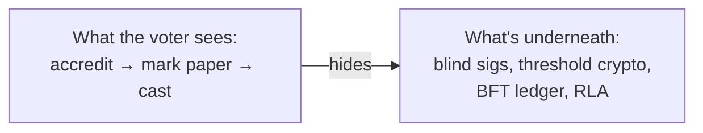

# 06 — Accessibility & Inclusion

*Covers brief §8 (Accessibility and Inclusion).*

> **Inclusion is a security property.** A system that quietly excludes the elderly,
> rural, disabled, or low-literacy voter doesn't just fail ethics — it changes
> outcomes and destroys legitimacy. We treat exclusion as a Critical risk
> ([04 §T14](04-security-threat-model.md)).

---

## 1. Design stance: lower the floor, don't raise the bar

The ordinary voter's experience must be **at least as simple as today's paper
ballot** — ideally simpler. All cryptographic and blockchain complexity is
**invisible** to them; it lives in backend code and observer tooling. A voter who
can mark an X on paper can use this system with zero new skills.

---

## 2. Inclusion by population

### 2.1 Rural communities
- **Offline-first** ([05](05-offline-connectivity.md)): no connectivity required to vote or count.
- **Solar/battery** power kits; nothing depends on the grid.
- Familiar **paper ballot** remains the primary interface — no behavior change required.
- Field support teams and spare devices per ward.

### 2.2 Elderly voters
- Paper-first; no requirement to use a screen.
- BMD (Ballot-Marking Device) offers **large text, high contrast, audio guidance**
  for those who want assistance, but it is optional.
- Generous time; no penalty for slowness; assistance by a person of the voter's
  choice permitted (as law already allows), logged for integrity.

### 2.3 Persons with disabilities
| Disability | Accommodation |
|-----------|----------------|
| Visual | Audio ballot (headphones), screen-reader-grade TTS in local languages, tactile/Braille ballot guides, high-contrast & large-font BMD |
| Motor | Large physical buttons, sip-and-puff / switch input on BMD, no fine-motor requirement |
| Hearing | Visual-first UI, captions, no audio-only steps |
| Cognitive / low literacy | Icon + party-logo + photo based selection; simple confirm screen; plain-language |
| Speech | No voice-input requirement anywhere |
- BMD **prints a human-readable paper ballot** the voter (or an assistant)
  verifies — so accessibility never sacrifices the software-independent paper record.
- Polling units must meet **physical access** standards (ramps, ground-floor,
  reachable equipment).

### 2.4 Multiple Nigerian languages
- Full UI + audio in **English, Hausa, Yoruba, Igbo, and Nigerian Pidgin** at
  minimum, with a roadmap to additional major languages.
- **Party logos, candidate photos, and color/number coding** make the ballot
  navigable **independent of literacy or language** — the proven Nigerian ballot
  design carried forward.

### 2.5 Low-literacy populations
- **Visual-first ballots:** photo + logo + symbol, exactly as Nigerians already
  vote, so recognition replaces reading.
- Audio walkthrough on the BMD.
- Confirmation screen restates the choice **visually** (the chosen logo/photo
  enlarged) before printing.

---

## 3. UX patterns that maximize usability *and* trust

- **Verify-on-paper, always.** The voter confirms a human-readable paper ballot;
  the machine never casts something the human didn't see. This is both an
  accessibility and an integrity pattern.
- **No accounts, no apps, no passwords for voters.** Identity is handled by
  in-person biometric accreditation, not by asking voters to manage credentials.
- **Progressive disclosure.** The default path is 3 steps. Verification/auditing
  features exist but are opt-in and out of the critical path.
- **Errors are recoverable and non-punitive.** Spoiled-ballot/re-do procedures are
  clear; a confused voter is never trapped.
- **Trust through familiarity.** Keep the recognizable rituals — the booth, the
  thumb-print ink, the public count, party agents watching — because *visible,
  familiar process* builds more trust than a slick screen.
- **Independent verifier apps.** Tech-literate citizens, parties, and observers get
  apps to verify signatures and re-sum results — turning skeptics into auditors.

---

## 4. The digital-literacy paradox (handled honestly)

A purely digital voting app would **disenfranchise tens of millions** of
low-literacy, elderly, or device-less Nigerians and concentrate participation
among the connected urban middle class — skewing outcomes. **This is a primary
reason we reject app/internet voting** ([14](14-final-recommendation.md)). The
voter touches *paper*; technology serves the *officials, auditors, and the public
record*, where digital literacy can be trained and concentrated, not the 90M+
voters, where it cannot.

---

## 5. Measuring inclusion (accountability)

- Publish **disaggregated** accessibility metrics per cycle: assisted-voting
  uptake, BMD failure rates, language usage, PU accessibility compliance,
  exception-form rates by region.
- Independent **disability and rural-community advisory panels** co-design and
  sign off on each phase.
- Treat any region with abnormal exception/rejection rates as an **inclusion
  incident** requiring response — the same seriousness as a security incident.
