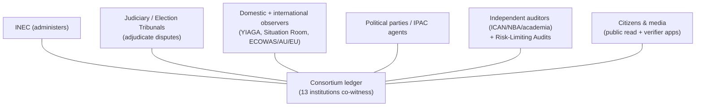
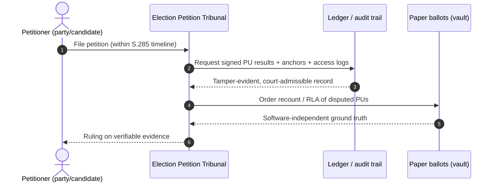

# 07 — Governance & Legal Framework (Nigeria)

*Covers brief §9 (Governance and Legal Framework). Prepared from the perspective
of a Nigerian constitutional/electoral lawyer. This is design analysis, not legal
advice; INEC must obtain formal opinions before deployment.*

---

## 1. Constitutional foundation

- The **1999 Constitution (as amended)** establishes INEC (Third Schedule, Part I)
  and empowers it to organize and supervise federal and state elections and to
  register voters.
- Elections must be **free, fair, and credible**; the franchise and the
  **secrecy of the ballot** are core democratic guarantees. Any system must
  preserve secret suffrage — a constitutional non-negotiable that **rules out
  voter-verifiable public vote records** (and thus naive on-chain votes).
- **Section 285** governs election petitions and tribunal timelines — the system
  must produce **court-admissible evidence within tight statutory windows**.

**Implication:** the design's append-only, signed, externally-anchored audit
trail is not just a tech nicety — it directly serves the constitutional dispute
process by giving tribunals authoritative, tamper-evident evidence.

---

## 2. Electoral Act 2022 — the enabling breakthrough

The **Electoral Act 2022** is the single most important legal enabler and the
reason this design is *legally plausible today*:

| Provision (effect) | Relevance to this design |
|--------------------|--------------------------|
| Legal backing for **electronic accreditation** of voters (BVAS) | Authorizes biometric accreditation we build on |
| Permits **electronic transmission of results** | Authorizes the core ledger/transmission layer |
| INEC empowered to **determine procedures** for accreditation, voting, transmission, collation | Gives INEC regulatory headroom to adopt the bulletin-board/ledger model |
| Recognizes the **PU result as foundational**, with collation built up from it | Matches our "publicly re-summable from PU" architecture |
| Smart-card/biometric register provisions | Aligns with identity layer |

> Crucially, the Act already moved Nigeria from "trust the collation officer" to
> "transmit and view PU results directly" (IReV). Our system is the **secure,
> non-repudiable successor to IReV**, squarely within the Act's intent.

---

## 3. Necessary legislative / regulatory amendments

| Area | Current gap | Proposed change |
|------|-------------|-----------------|
| Status of the ledger | No explicit recognition of a multi-party cryptographic ledger as the official transmission/collation record | Amend Act/INEC regulations to define the consortium ledger and **the conditions under which a signed PU result is the authoritative transmitted record** |
| Software independence / audits | No statutory **Risk-Limiting Audit** requirement | Mandate RLAs before certification; define audit triggers, sample math, and public observation |
| Open-source & certification | No requirement to publish/independently certify election software | Require **public source availability** of critical components and independent certification before each cycle |
| Paper primacy | Ambiguity if digital and paper diverge | Codify: **verified paper ballot, confirmed by audit, is the legal record of truth**; digital is corroborating |
| Validator governance | No legal basis for non-INEC institutions to co-witness results | Statutory/MOU framework for consortium nodes (judiciary, observers, parties, academia) and their duties/liabilities |
| Data protection | Biometric/identity processing at national scale | Explicit lawful basis + safeguards under NDPA 2023 (below) |
| Result timelines | Offline sync may lag | Clarify collation windows to lawfully accommodate **signed but delayed** PU results without enabling abuse |

These are **amendments and regulations, not a constitutional overhaul** — a
realistic legislative lift, especially as they extend the 2022 Act's existing
direction rather than reverse it.

---

## 4. Data protection obligations (NDPA 2023)

The **Nigeria Data Protection Act 2023** and the **NDPC** govern processing of
personal and biometric data.

- **Lawful basis:** processing for elections should rest on **legal
  obligation/public interest**, defined in the electoral law — not consent (voters
  can't meaningfully "consent" away electoral processing).
- **Data minimization & purpose limitation:** PII and biometrics are processed
  **only** for accreditation and **never written to the immutable ledger**
  ([01 §7](01-architecture.md)). "Immutable + personal data" would itself breach
  NDPA — our off-chain design is a *compliance requirement*, not just good taste.
- **Storage limitation:** biometric templates stay on-device / in INEC's existing
  protected register; not centralized into new honeypots.
- **DPIA:** a full **Data Protection Impact Assessment** is mandatory pre-deployment.
- **Cross-border:** all data and nodes **resident in Nigeria**; sovereignty over
  electoral data is non-negotiable.
- **Rights & breach:** NDPA breach-notification and data-subject rights apply
  (with election-integrity-appropriate limits, e.g. no "erasure" of audit events).

---

## 5. Audit, oversight & observers

- **Observers** get **read nodes / API access and verifier tooling**, and a defined
  role in the **public RLA** — elevating them from passive watchers to
  cryptographic auditors.
- **Independent audit** by chartered accountants + academics, with published
  methodology and results.
- **Legislative oversight** via the National Assembly; **judicial oversight** via
  tribunals armed with the audit trail.

---

## 6. Dispute resolution

The system's gift to dispute resolution: tribunals no longer adjudicate "your word
vs. INEC's server." They examine **cryptographically signed PU results that party
agents already hold matching printouts of**, cross-checked against **paper**. This
directly attacks the root cause of post-election litigation and violence.

---

## 7. Legal barriers & proposed solutions

| Barrier | Solution |
|---------|----------|
| Secret-ballot vs. verifiability tension | E2E-V receipt-freeness ([03](03-cryptography-and-privacy.md)); paper remains secret; no public per-voter vote |
| Tight petition timelines vs. audit time | Pre-defined, fast RLA protocols; real-time published PU data shortens evidence-gathering |
| Immutability vs. legal right to correct errors | Append-only **amendments with reasons**, never deletion; courts can order exclusion/recount of flagged PUs |
| Multi-institution validators lacking legal mandate | Statutory + MOU framework defining roles, duties, liabilities |
| Procurement, vendor lock-in, sovereignty | Open-source mandate, multi-vendor, data residency in Nigeria, local capacity building |
| Public/political acceptance | Phased rollout with public mock-attacks and full transparency ([08](08-transparency.md), [11](11-cost-implementation.md)) |

---

## 8. Governance guardrails (anti-capture)

- **Separation of powers in the validator set** ([01 §6](01-architecture.md)): no
  single arm of government or party holds a blocking share.
- **Threshold keys** ([03](03-cryptography-and-privacy.md)): no single institution
  can decrypt or certify alone.
- **Rotating party seats** balanced between government and opposition.
- **Mandatory public transparency** ([08](08-transparency.md)) so capture would
  have to be *publicly* visible to succeed — which is the point.
