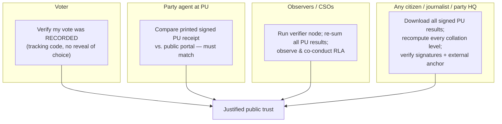
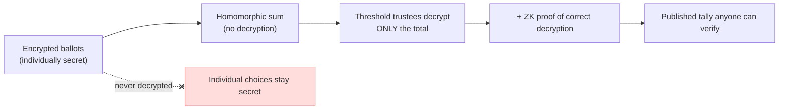

# 08 — Transparency & Public Trust

*Covers brief §10 (Transparency and Public Trust).*

---

## 1. The core trust problem in Nigerian elections

Nigeria's elections are not primarily lost to mis-marked ballots at the booth.
They are lost to **distrust of what happens between the polling unit and the
declared result** — collation, transmission, and certification. The 2023 cycle's
flashpoint was exactly this: results visible at PUs, but doubt about whether the
nationally-declared figures faithfully reflected them.

**Therefore, transparency is not a feature of this system — it is the product.**
Every other component exists to make the journey from "ballot in the box" to
"declared winner" **publicly, independently, and mathematically verifiable.**

---

## 2. Layers of verification (who can check what)

| Actor | Can independently verify | Tool |
|-------|--------------------------|------|
| Voter | Their ballot was *recorded as cast* | Tracking code on public portal |
| Party agent | The PU result they witnessed = the published one | Printed signed receipt vs. portal |
| Observer/CSO | Every aggregation level sums correctly; RLA confirms paper | Verifier node + RLA participation |
| Any citizen | All signatures valid; national total = sum of PUs; ledger = external anchor | Open verifier app + public data |
| Tribunal | Full tamper-evident evidence chain | Court access to ledger + paper |

The key shift: **trust no longer requires trusting INEC.** It requires trusting
*math* and the fact that *rival institutions co-witnessed the same signed record*.

---

## 3. Mechanisms

### 3.1 Public, open bulletin board (IReV successor)
- Every signed PU result published **in real time** as it syncs, with its
  signatures and result-sheet hash — the digital, non-repudiable successor to IReV.
- **Pending PUs are shown openly** (not hidden), eliminating the "where did the
  uploads go?" suspicion.
- Bulk **open-data download** of all signed results so anyone can recompute totals.

### 3.2 Independent verification, multiple implementations
- Publish the **trust roots** (institutional public keys) so *any* third party can
  build a verifier.
- Encourage **multiple independent verifier apps** (parties, CSOs, media,
  academia) — diversity prevents a single compromised portal from deceiving everyone.

### 3.3 External anchoring
- Hourly **Merkle roots anchored to a public blockchain** ([01 §3](01-architecture.md)):
  an immutability witness **outside the consortium's control**, so even a fully
  colluding consortium cannot quietly rewrite history.

### 3.4 Risk-Limiting Audits (RLAs) — the keystone
- Publicly-observed statistical audits of the **paper** confirm the reported
  outcome with quantified confidence, **before** certification.
- This is what makes the whole system **software-independent**: even if every
  digital component were compromised, the RLA on paper would catch an outcome-
  changing error.

### 3.5 Open-source review of critical components
- Voting/marking firmware, chaincode, tally, and verifier code are **public and
  independently audited** before each phase.
- **Reproducible builds** so the public can confirm deployed binaries match the
  audited source.
- Continuous **coordinated disclosure + bug bounty** ([04](04-security-threat-model.md)).

### 3.6 Public mock elections (adversarial transparency)
- Before each rollout phase, run **public test elections where citizens are invited
  to attack the system.** Surviving public scrutiny is the most credible
  trust-builder available — and turns the strongest skeptics into validators.

---

## 4. Cryptographic proof of result accuracy *without* compromising secrecy

This is the property that distinguishes a real E2E-V system from theater:

Anyone can verify the **total is correct** and that **no individual ballot was ever
decrypted** — proof of accuracy *with* secrecy. Cross-checked against the
paper-count + RLA, this gives two independent integrity guarantees.

---

## 5. Building confidence with each stakeholder

| Stakeholder | What earns their trust |
|-------------|------------------------|
| **Political parties** | Their agents hold signed PU receipts that *must* match the portal; they run validator/verifier nodes; balanced party seats; they can re-sum everything themselves |
| **Civil society / observers** | Validator + verifier access; central role in RLAs; open source; open data |
| **Ordinary citizens** | Familiar paper ballot + public count; ability to verify their vote was recorded; transparent pending-PU visibility; media verifiers |
| **International community** | Observer mission validator access; open standards; published audits |
| **The losing side** | The strongest test: even the loser can mathematically confirm they lost — the precondition for peaceful transfers of power |

> The ultimate metric of success: **the losing candidate's own agents can verify,
> from data they independently hold, that the result is correct.** A system that
> can convince the loser is a system that prevents post-election violence. That —
> not throughput or novelty — is the real deliverable.

---

## 6. Honest caveat

Transparency tooling only builds trust **if it is actually used and understood.**
Most voters won't run a verifier. The trust transfers through *intermediaries* —
party agents, observers, journalists, academics — who *do* verify and whom the
public trusts. Funding and training this **"verification civil society"** is as
important as the cryptography itself, and is budgeted in
[11-cost-implementation](11-cost-implementation.md).
