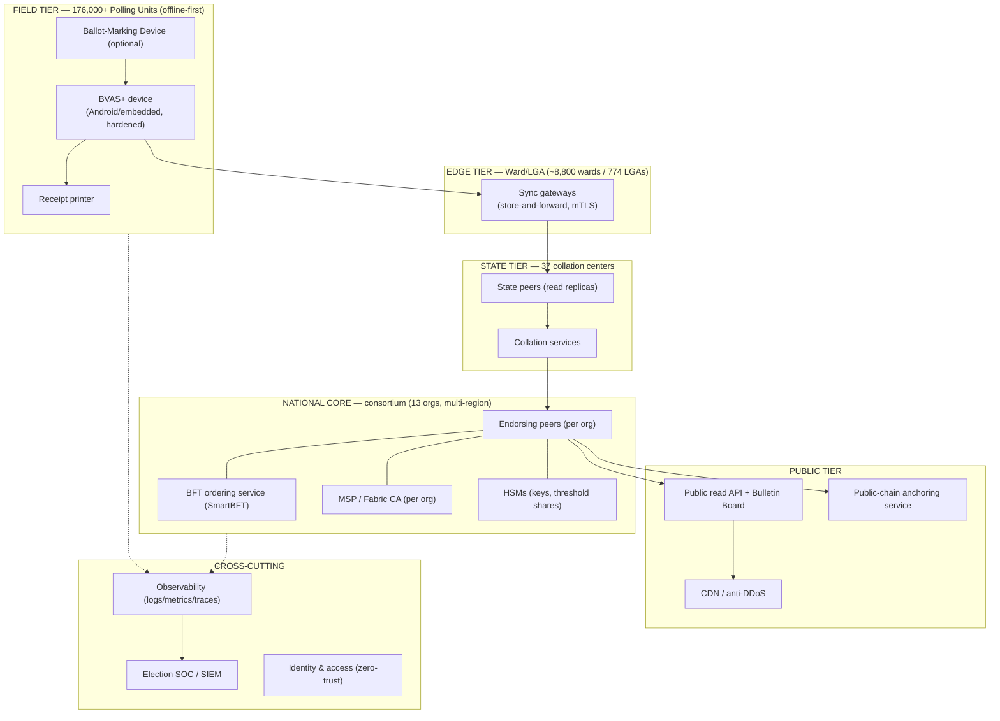
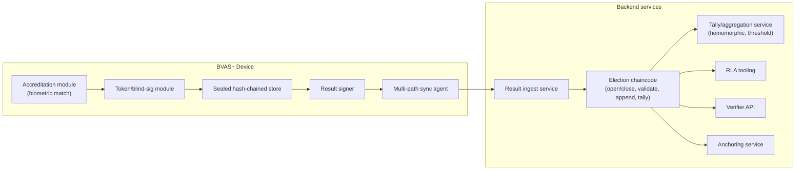
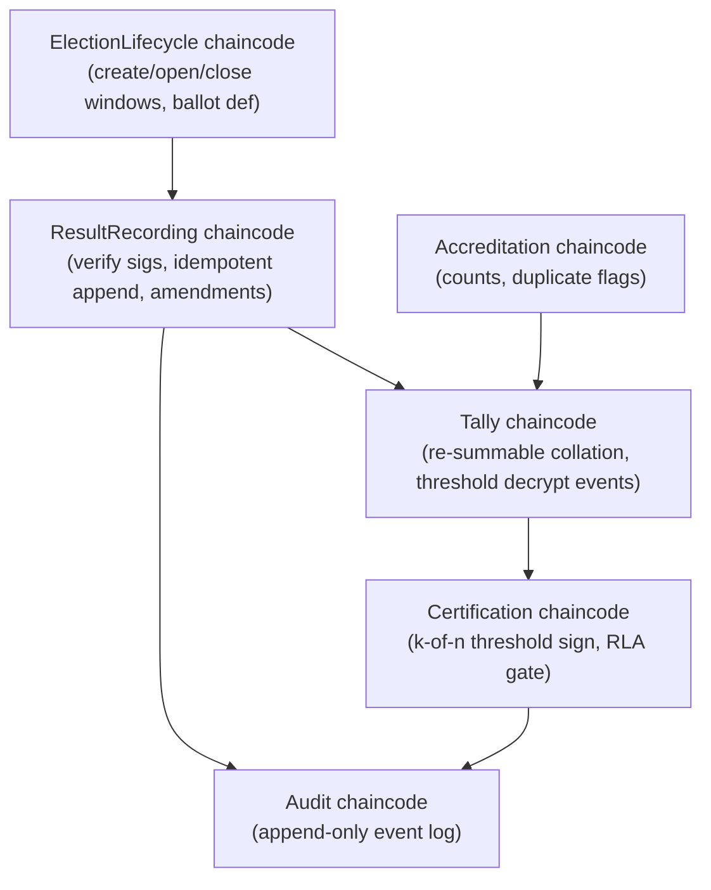

# 09 — Technical Architecture, APIs, Data & DevSecOps

*Covers brief §11 (Technical Architecture).*

---

## 1. High-level architecture



---

## 2. Component view



---

## 3. API architecture

REST/gRPC, OpenAPI-documented, versioned, mTLS for write paths, public read paths
cacheable and anonymous.

| Domain | Endpoint (illustrative) | Method | Auth | Notes |
|--------|------------------------|--------|------|-------|
| Election setup | `/v1/elections` | POST | INEC + co-sign | Create election, ballot definition (signed) |
| Ballot def | `/v1/elections/{id}/ballot` | GET | public | Signed ballot definition |
| Accreditation | `/v1/accreditation/events` | POST | device cert (mTLS) | Anonymous accreditation counts (no PII) |
| Result ingest | `/v1/results/pu` | POST | device + officer sig | Idempotent on PU result ID |
| Bulletin board | `/v1/results/pu/{puId}` | GET | public | Signed PU result + sheet hash |
| Bulk data | `/v1/results/export` | GET | public | All signed PU results (open data) |
| Aggregation | `/v1/results/collation/{level}/{id}` | GET | public | Re-derivable totals + proof |
| Voter verify | `/v1/verify/{trackingCode}` | GET | public | "recorded as cast" (no choice reveal) |
| Anchors | `/v1/anchors` | GET | public | External-chain Merkle roots |
| RLA | `/v1/audit/rla/{electionId}` | GET | public | Audit plan, samples, results |
| Trust roots | `/v1/trust/keys` | GET | public | Institutional public keys for verifiers |
| Admin/keys | `/v1/ceremony/*` | POST | k-of-n threshold | Key gen / certification ceremonies |

**API principles:** write paths require hardware-backed credentials; read paths are
public, static-cacheable, and DDoS-resilient; **no endpoint can return
voter-identity-linked vote data** (enforced in code + schema).

---

## 4. Data design

### 4.1 On-ledger (Fabric world-state + blocks) — minimal, no PII

```
PollingUnitResult {
  puId, electionId, contestId
  candidateCounts: map<candidateId, uint>
  accreditedCount, validVotes, rejectedVotes
  resultSheetHash            // hash of EC8 photo
  deviceSig, presidingOfficerSig, witnessSigs[]
  submittedAt, syncPath
  resultRound                // for explicit amendments
  prevHash                   // device-side hash chain ref
}
AccreditationTally { puId, electionId, accreditedCount, deviceSig }  // counts only
Nullifier { value }                  // spent-token markers (digital layer), no identity
Commitment { trackingCode, ciphertext, zkWellFormednessProof }       // E2E-V layer
CertificationEvent { electionId, level, id, thresholdSig, decryptionProof }
AnchorRecord { merkleRoot, externalTxRef, timestamp }
AuditEvent { type, actorOrg, ref, sig, timestamp }     // append-only audit log
```

### 4.2 Off-ledger (INEC-controlled, protected; NEVER on chain)
- Voter register (PII, biometric templates) — stays in INEC's existing secured
  systems / on-device register slices.
- Result-sheet images & device logs — stored in object storage; only **hashes**
  go on-chain.
- Mapping of tracking codes → voters is **not stored anywhere** (coercion resistance).

### 4.3 Why this split
"Immutable ledger + personal data" is both an NDPA violation and an irreversible
privacy breach. **Hashes and commitments on-chain; data off-chain.** See
[01 §7](01-architecture.md) and [07 §4](07-governance-legal.md).

---

## 5. Smart-contract (chaincode) architecture



- Written in **Go** (audited), each with strict role checks via MSP identity.
- **No deletes/updates of results** — only appends and signed amendments.
- Time-window enforcement (no results before close, etc.).
- See full pseudocode in [13-smart-contract-pseudocode](13-smart-contract-pseudocode.md).

---

## 6. Infrastructure & deployment

### 6.1 Hybrid on-prem + sovereign cloud
| Tier | Hosting | Rationale |
|------|---------|-----------|
| Field devices | INEC-owned hardened devices | Physical control, offline operation |
| Edge gateways | INEC ward/LGA sites + telco edge | Proximity, store-and-forward |
| Consortium core | **Each validator org hosts its own node** across ≥3 geographically separate, Nigeria-resident data centers (mix of gov data centers + sovereign cloud) | True decentralization of custody; no single host controls consensus |
| Public tier | Sovereign cloud + global CDN (read-only) | Scale + DDoS resilience for public reads |

- **Data residency in Nigeria** for all electoral data (sovereignty, NDPA).
- **No single cloud provider** holds the system of record; nodes are
  org-operated and heterogeneous to avoid correlated failure/capture.

### 6.2 Containerized & reproducible
- Kubernetes per org for peers/services; **reproducible, signed images**; GitOps
  deployment; infrastructure-as-code (Terraform/Ansible) under version control and
  public review for non-sensitive parts.

---

## 7. DevSecOps pipeline

```mermaid
flowchart LR
    src["Public source repo"] --> pr["PR + mandatory review<br/>(multi-party for critical code)"]
    pr --> sast["SAST + secrets scan + license check"]
    sast --> sca["SCA / SBOM (deps pinned, SLSA)"]
    sca --> test["Unit + integration + property tests"]
    test --> repro["Reproducible build + sign artifact"]
    repro --> dast["DAST + fuzzing"]
    dast --> audit["Independent security audit gate (per phase)"]
    audit --> stage["Staging / mock-election env"]
    stage --> canary["Canary + attestation check"]
    canary --> prod["Signed deploy to production"]
    prod --> mon["Continuous monitoring"]
```



- **Supply-chain hardening:** SBOM, dependency pinning, SLSA provenance, signed
  artifacts, reproducible builds the public can verify (counters [04 T7](04-security-threat-model.md)).
- **Multi-party code review** required for critical components (no single
  maintainer can ship voting-affecting code).
- **Gated by independent audit** before each rollout phase.

---

## 8. Monitoring, logging & observability

- **Metrics:** ledger commit rate, ingest lag per state, pending-PU counts, device
  health/battery, sync-path distribution, consensus health, API latency.
- **Logs:** structured, signed, shipped to tamper-evident store; security events to
  SIEM in the **Election SOC** ([04 §5](04-security-threat-model.md)).
- **Tracing:** end-to-end trace of a PU result from device → ledger → portal.
- **Public dashboards:** pending PUs, turnout, results progress — transparency as
  monitoring.
- **Alerting:** anomaly detection on turnout vs. accreditation, ingest spikes,
  signature failures, anchor mismatches → E-SOC playbooks.

---

## 9. Zero-trust & identity (platform)
- Every service-to-service call **mutually authenticated (mTLS)**; least-privilege
  IAM; short-lived credentials; HSM-held keys; per-device certificates issued and
  revocable via Fabric CA/MSP; admin actions require **dual control / threshold**.
