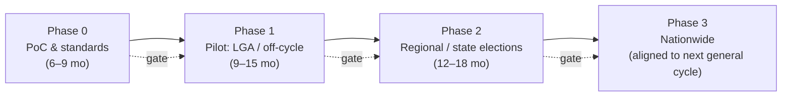

# 11 — Cost & Phased Implementation Strategy

*Covers brief §13 (Cost and Implementation Strategy).*

> **Cost disclaimer:** figures are **order-of-magnitude planning estimates** for a
> proposal, in USD, to be validated against Nigerian procurement reality, naira
> exchange rates, and the degree to which existing BVAS/IReV assets are reused.
> They are deliberately conservative and ranged. They are *not* a quotation.

---

## 1. Phasing philosophy

**Never roll out nationally without proving each layer under real adversarial
conditions.** Each phase has explicit **go/no-go gates** tied to security audits,
RLA success, accessibility metrics, and public-trust measures. A failed gate
**stops** the rollout — by design. Elections are not a domain for "move fast and
break things."

---

## 2. Phase plan

### Phase 0 — Proof of Concept & Standards (≈6–9 months)
- Build core chaincode, BVAS+ result-signing, bulletin board, verifier, RLA tooling.
- Stand up a **test consortium** with real institutions (judiciary, observers,
  academia) running nodes.
- **Public mock election** + open security audit + published source.
- Draft the **legal/regulatory amendments** ([07](07-governance-legal.md)) in parallel.
- **Gate:** independent audit pass; successful RLA on mock; legal pathway viable.

### Phase 1 — Pilot (≈9–15 months)
- Deploy in a **small number of LGAs / a single off-cycle or local election**.
- Full offline operation, real voters, real observers, real RLA, real disputes.
- Accessibility validation with disability/rural panels.
- **Gate:** RLA confirms results; no Critical security findings; accessibility &
  trust metrics met; stakeholder (parties, CSOs) sign-off.

### Phase 2 — Regional / State (≈12–18 months)
- Deploy across **several states / a gubernatorial cycle**.
- Scale consortium to full 13 orgs; exercise multi-state sharding, DR drills,
  E-SOC under load.
- **Gate:** sustained performance, successful RLAs across states, legal amendments
  enacted, public confidence trending positive.

### Phase 3 — Nationwide (aligned to a general election cycle)
- All 36 states + FCT, all six contest types.
- Full transparency, RLA, anchoring, observer participation.
- **Even here, paper remains primary** and RLA gates certification.

> **Realistic total horizon: ~4–6 years** from PoC to a fully nationwide general
> election — and that is *appropriate*; rushing electoral technology is how trust
> is destroyed.

---

## 3. Cost estimate (planning ranges, USD)

| Category | Phase 0 | Phase 1 | Phase 2 | Phase 3 (nationwide/cycle) |
|----------|---------|---------|---------|----------------------------|
| Software dev & security audits | $3–6M | $4–8M | $5–10M | $8–15M |
| Devices (BVAS+ / BMD)* | minimal (reuse) | $5–15M | $20–60M | **$150–400M** |
| Consortium infra (13 orgs, multi-region) | $1–2M | $2–4M | $4–8M | $8–15M/cycle |
| Connectivity / sync (incl. VSAT/SMS) | $0.5M | $2–5M | $8–20M | $30–80M |
| Training & change management | $0.5M | $3–8M | $10–25M | **$40–100M** |
| Public education & verification CSOs | $0.5M | $2–5M | $8–20M | $30–70M |
| Legal/governance/ceremonies | $0.5M | $1–2M | $2–4M | $5–10M |
| Operations & E-SOC | $0.5M | $1–3M | $4–10M | $20–50M |
| **Indicative phase total** | **~$7–17M** | **~$20–55M** | **~$70–160M** | **~$300–740M** |

\* *Device cost dominates and depends heavily on reuse of existing BVAS fleet. If
BVAS hardware is upgraded via firmware/software rather than replaced, Phase 3
device cost falls dramatically.*

**Context:** Nigeria's 2023 general election budget was roughly **₦305B
(~$650M–700M at then-rates)**. A blockchain *verification layer that reuses BVAS*
is plausibly an **incremental** cost on top of existing election spend, **not** a
greenfield mega-project — *provided* we reuse BVAS/IReV. This reuse is a core
reason the design is fiscally realistic.

> **Honest cost caveat:** the expensive parts are **devices, training, connectivity,
> and people** — i.e., the *non-blockchain* parts. The blockchain itself is among
> the cheapest line items. That fact alone should inform how loudly "blockchain" is
> marketed vs. where the money and risk actually are.

---

## 4. Staffing

| Function | Indicative team (steady state) |
|----------|-------------------------------|
| Engineering (chaincode, devices, backend, verifier) | 40–80 |
| Security / E-SOC / red team | 20–40 |
| Cryptography & audit liaison | 5–10 |
| DevSecOps / SRE | 15–30 |
| Field operations & logistics | hundreds (election-time, INEC-led) |
| Training & change management | 30–60 + state trainers |
| Legal / governance / stakeholder | 10–20 |
| UX / accessibility / localization | 10–20 |
| Independent auditors & observers | external, ongoing |

Plus the **~700,000+ ad-hoc poll officials** INEC already mobilizes per general
election, who need **focused, simple training** on the *paper-first* workflow (the
tech is designed so their job barely changes).

---

## 5. Training programs

- **Poll officials:** hands-on, simulation-based; emphasize that **paper is the
  vote** and the device merely accredits and signs the count. Keep cognitive load
  minimal.
- **Party agents:** how to read and verify their **printed signed receipt** against
  the portal — turning every agent into an auditor.
- **Observers/CSOs:** verifier tooling, RLA participation, node operation.
- **Public education:** mass multilingual campaign (radio dominant in rural areas,
  not just internet) explaining what changed and how to verify — *before* the
  first binding use.
- **Technical custodians (academia/INEC):** node operation, key ceremonies, DR.

---

## 6. Critical success factors (and failure modes)

| Success factor | If neglected → failure mode |
|----------------|-----------------------------|
| Reuse BVAS/IReV | Cost & timeline balloon; political rejection |
| Paper-first + RLA mandated in law | System becomes unauditable theater |
| Genuine multi-institution consortium | "Blockchain" becomes INEC's database with extra steps → no trust gain |
| Public education funded as a first-class line | Confusion, rumor, rejection regardless of technical quality |
| Phased gates honored | Premature national rollout → high-profile failure → sets back e-voting a decade |
| Connectivity/offline robustness | Repeat of upload-delay controversies |

> The biggest risks to this program are **political, logistical, and educational —
> not cryptographic.** Budget and govern accordingly.
