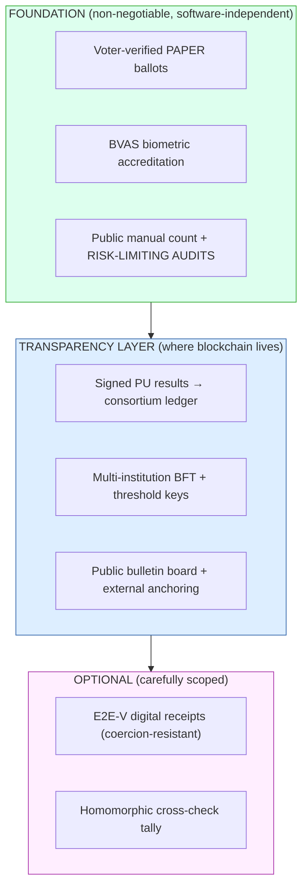

# 14 — Final Recommendation: Is Blockchain Genuinely Advantageous for Nigeria?

*Covers the final-recommendation deliverable in brief §15. This is the document the
brief explicitly asked us to be most objective and challenging about.*

---

## 1. The question, answered directly

> **Is blockchain genuinely advantageous for Nigeria's electoral environment, or
> would alternative architectures better achieve the same goals?**

**Answer: Blockchain is *narrowly* advantageous — but only as a supporting
transparency/audit layer, and only in a permissioned consortium form. It is *not*
the foundation of a trustworthy election, and any proposal that treats "the
blockchain as the ballot box" is misguided and should be rejected.** The
foundation is, and must remain, **voter-verified paper + risk-limiting audits +
strong in-person biometric accreditation (BVAS)**. Within that foundation, a
consortium ledger delivers real, specific value at the exact point where Nigeria's
elections have historically broken: **results transmission and collation.**

So: **yes, use blockchain — but keep it in its lane, and be honest that it is the
junior partner.**

---

## 2. What blockchain genuinely adds (the honest "for")

| Real benefit | Why it matters in Nigeria specifically |
|--------------|----------------------------------------|
| **Multi-party, tamper-evident collation record** | The 2023 dispute was about transmission/collation trust. A ledger co-witnessed by judiciary, opposition, observers, and academia converts "trust INEC's server" into "trust math + rival institutions." |
| **Non-repudiation** | PU results signed at source + held as printed receipts by party agents make any post-PU alteration *provable*, not merely alleged. |
| **No single point of trust/control** | BFT + threshold keys + external anchoring mean no single institution can rewrite or fabricate results. |
| **Public recomputability** | Anyone can re-sum published PU results to the national total — collation fraud becomes arithmetically impossible to hide. |
| **Court-admissible audit trail** | Tribunals get authoritative, tamper-evident evidence within statutory timelines. |

These are **governance and transparency** benefits — precisely Nigeria's pain
point. That is why blockchain earns a place here when it doesn't in many other
electoral contexts.

---

## 3. What blockchain does NOT solve (the honest "against")

| Hard problem | Does blockchain solve it? | What actually solves it |
|--------------|---------------------------|--------------------------|
| Malware on the voting/marking device | ❌ No (garbage in → immutable garbage) | **Voter-verified paper** + RLA |
| Voter coercion / vote-buying | ❌ No | Secret paper ballot + receipt-freeness + law |
| Ballot secrecy | ❌ Naively *worsens* it | Off-chain ballots + blind sigs + threshold crypto |
| "Was the count correct?" | ❌ Only records *reported* numbers | **Public manual count + RLA on paper** |
| Identity / eligibility | ❌ No | **BVAS biometrics + NIN de-dup** |
| Connectivity / rural access | ❌ No (and naive designs *assume* connectivity) | Offline-first paper process |
| Digital exclusion | ❌ Risks worsening it | Paper-first, no voter device needed |

> **The decisive point:** the property that makes an election trustworthy is
> **software independence** — an undetectable software change cannot cause an
> undetectable outcome change. **Blockchain does not provide software
> independence.** Paper + RLA does. Therefore blockchain *cannot* be the foundation;
> it can only be a verifiable witness on top of one.

---

## 4. Could a non-blockchain architecture achieve the same goals?

**Mostly yes — and we should say so plainly.** Most of blockchain's value here could
be approximated by:

- **Digitally-signed PU results** published to a transparent portal (signatures,
  not consensus, give non-repudiation), **plus**
- A **transparency/append-only log** (e.g. a Certificate-Transparency-style Merkle
  log) co-witnessed by multiple institutions, **plus**
- **Threshold cryptography and RLAs** (which are independent of blockchain).

A **permissioned blockchain is essentially "a replicated, BFT, multi-institution
append-only log with strong identity."** You could build the equivalent from
signed logs + Merkle trees + a witness cosignature scheme. So the intellectually
honest position is:

> Blockchain is **a convenient, well-tooled, well-understood packaging** of
> properties (multi-party append-only, BFT agreement, tamper-evidence) that you
> *could* assemble from other primitives. Its marginal advantage is **integration,
> maturity of tooling (Fabric MSP = institutions), and — crucially — political
> legibility**: "blockchain" communicates "no one can secretly change it" to
> stakeholders and the public in a way a bespoke signed-log system does not.

**When does blockchain clearly win over a plain signed log?** When you need
*multiple mutually-distrusting institutions to agree on one ordered, shared record
with no privileged writer* — which is exactly the consortium collation use case.
For a *single* trusted writer, a signed log is simpler and just as good; blockchain
would be over-engineering.

---

## 5. The recommendation, precisely scoped

**Adopt:** consortium Hyperledger Fabric as the collation/transmission
transparency layer, on top of an uncompromisingly paper-anchored, RLA-audited,
BVAS-accredited process.

**Reject:** internet/app voting; public PoW/PoS chains as the system of record;
on-chain ballots/PII; "blockchain replaces paper"; any design without mandatory
RLAs.

---

## 6. Conditions without which we recommend NOT proceeding

This recommendation is **conditional**. If these cannot be met, a blockchain
system would be trust *theater* and we would advise against it:

1. **RLAs mandated in law** and actually conducted — the keystone.
2. **Paper primacy codified** — paper, confirmed by audit, is the legal truth.
3. **A genuinely independent consortium** — if all nodes are effectively INEC,
   the "blockchain" is just INEC's database and adds *no* trust. The
   multi-institution separation is the whole point.
4. **Open source + reproducible builds + public audits.**
5. **Honest public communication** — no overselling "unhackable blockchain."
6. **Phased rollout with real go/no-go gates** ([11](11-cost-implementation.md)).

If 1–3 in particular cannot be guaranteed, **do not deploy blockchain** — improve
BVAS/IReV with signed results and audits instead, which captures most of the value
at lower risk.

---

## 7. Bottom line for INEC

- Nigeria's trust deficit lives in **collation and transmission**, and that is
  *exactly* where a permissioned, multi-institution ledger genuinely helps. So
  there **is** a real, defensible case for blockchain here — narrower and more
  honest than the hype, but real.
- The **outcome's integrity** must rest on **paper + RLA + BVAS**, not on the
  chain. Blockchain makes fraud *detectable and publicly provable*; paper makes the
  truth *recoverable*. You need both, in that order of priority.
- An alternative (signed transparency logs + RLA, no blockchain) would achieve
  ~80–90% of the benefit. We recommend blockchain over it primarily for
  **multi-party trust, tooling maturity, and political legibility** — provided the
  consortium is *real*. If it can't be, drop the blockchain, keep everything else.

> **Final word:** The most trustworthy thing about this proposal is not its
> cryptography or its ledger — it is that it tells you cryptography and ledgers are
> *not* what make an election trustworthy. Paper you can recount, audits you can
> observe, accreditation you can witness, and institutions that check each other:
> those build trust. Blockchain, used honestly and narrowly, makes that trust
> **faster, broader, and harder to dispute.** Used dishonestly and broadly, it
> becomes a sophisticated way to launder distrust. The difference is entirely in
> the discipline of the design — and this proposal chose discipline.
